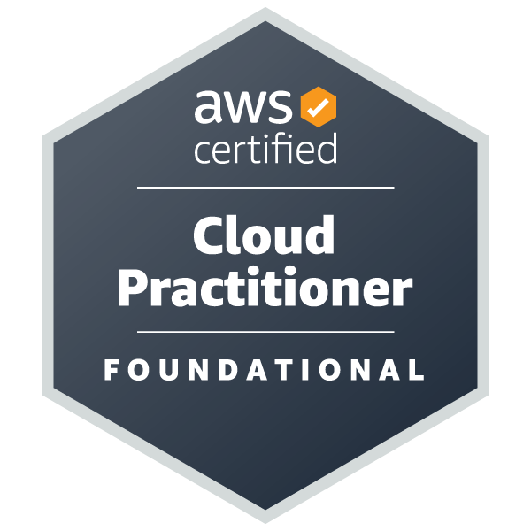
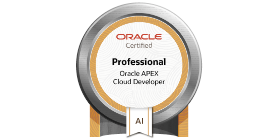
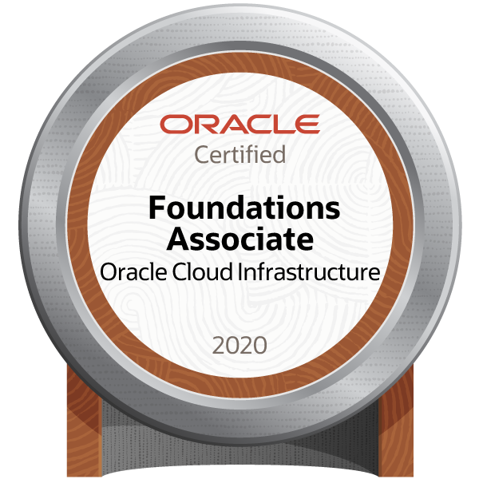
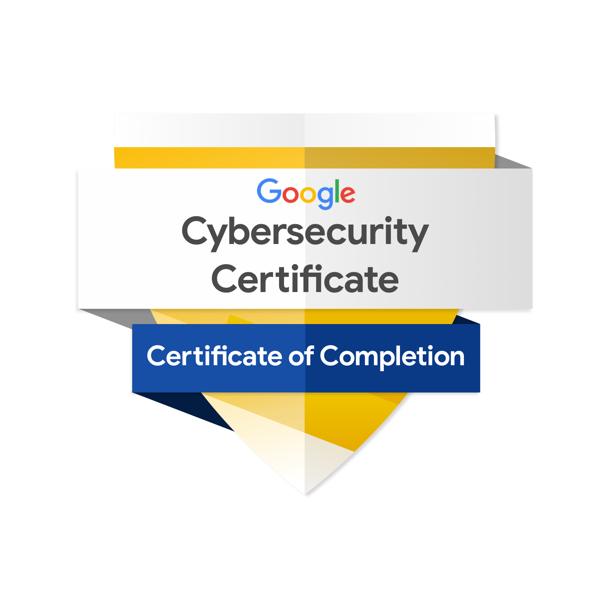
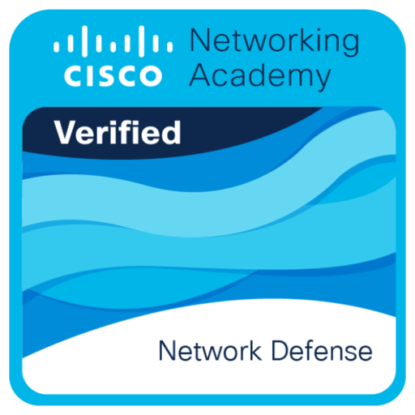
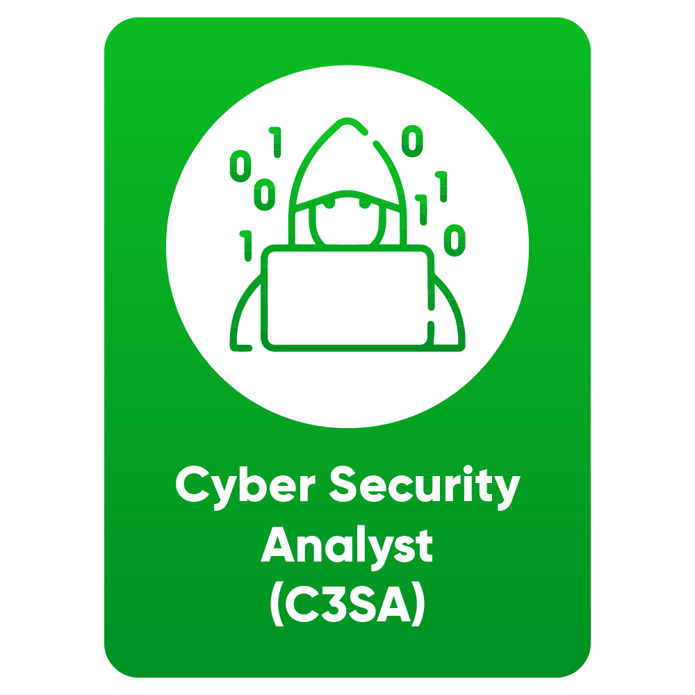

<h1 align="center">Olá, eu sou Filipe Jacobson Marra 👋</h1>

  <b>Engenharia de Software • Inteligência Artificial • Cloud • Dados • Segurança</b>

  Estudante de Engenharia de Software, com experiência em desenvolvimento de software, IA aplicada, cloud, análise de dados e segurança da informação.

  
  &nbsp;
  
  &nbsp;
  

---

## 🏅 Certificações

  
  &nbsp;&nbsp;
  
  &nbsp;&nbsp;
  
  &nbsp;&nbsp;
  

  
  &nbsp;&nbsp;
  
  &nbsp;&nbsp;
  

---

## 💻 Linguagens e Tecnologias

  

---

## 🚀 Sobre mim

- 🎓 Graduando em **Engenharia de Software** no **IDP**
- 🤖 Atuação com **Inteligência Artificial**, **assistentes virtuais**, **automação**, **cloud** e **dados**
- ☁️ Experiência com **AWS**, **Azure**, **GCP** e **Oracle Cloud**
- 🔐 Interesse forte em **segurança da informação**
- 🧠 Perfil voltado para construção de soluções reais, escaláveis e úteis

---

## 📌 Projetos e Iniciativas

### **Sistema para o Ministério da Ciência, Tecnologia e Inovação**
Projeto em Python para automatizar o controle e a prestação de contas de startups investidas pelo MCTI.

### **Potencializa Jovem (META)**
Projeto com Python e Llama 3 voltado ao engajamento e capacitação de jovens, com IA para redução de evasão em cursos.

---

## 🏆 Conquistas e Hackathons

- 🥇 **Primeiro Lugar no Hackathon CTF (Jeopardy)**
- 🏥 **Hackathon da FAP DF** com desenvolvimento de app iOS para gestão hospitalar
- 🧠 **Hackathon de Inteligência Artificial - Desabafa**, projeto vencedor com foco em saúde mental

---

## 📊 Estatísticas do GitHub

  
  

---

## 📫 Contato

  
  &nbsp;
  
  &nbsp;
  

